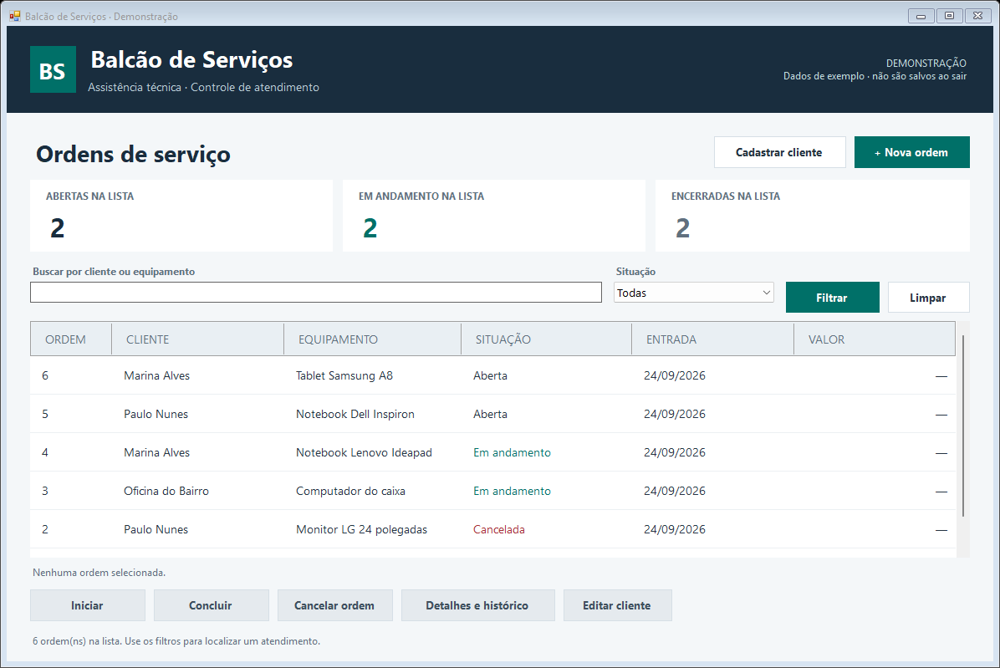

# Balcão de Serviços

[](https://github.com/fbottega-dev/balcao-servicos-winforms/actions/workflows/ci.yml)

Aplicativo Windows para acompanhar ordens de serviço de uma assistência técnica. O cliente chega com um equipamento, a ordem entra na fila e o atendimento fica registrado até a conclusão ou o cancelamento.

Projeto de estudo com **C# 5, .NET Framework 4.8, WinForms, Entity Framework 6 e SQL Server**. A solução usa `.csproj` tradicional, `packages.config` e MSBuild para praticar uma estrutura comum em aplicações desktop antigas.



Veja também o [cadastro de uma ordem](docs/nova-ordem.png) e os [detalhes do atendimento](docs/detalhes.png).

## O que dá para fazer

- Cadastrar clientes e abrir ordens com equipamento e descrição do problema.
- Corrigir nome e telefone do cliente de uma ordem. O nome atualizado aparece em todas as ordens desse cliente.
- Buscar por cliente, equipamento ou descrição e filtrar pela situação.
- Iniciar um atendimento, concluir com valor e observação ou cancelar informando o motivo.
- Consultar o problema informado pelo cliente e o histórico da ordem, incluindo abertura e mudanças de situação.
- Experimentar a aplicação sem instalar banco, usando o modo demonstração.

Uma ordem passa de **Aberta → Em andamento → Concluída**. O cancelamento é permitido enquanto ela estiver aberta ou em andamento. Uma ordem encerrada não recebe novas alterações de situação.

A lista inicia sem uma ordem selecionada. Depois de usar os filtros, as ações só ficam disponíveis quando você seleciona uma linha; se a ordem selecionada ainda aparecer no resultado, ela continua marcada.

## Rodar no Windows

Para experimentar sem compilar, baixe o ZIP em [Releases](https://github.com/fbottega-dev/balcao-servicos-winforms/releases/latest), extraia a pasta inteira e abra `iniciar-demo.cmd`. É necessário ter o .NET Framework 4.8 instalado.

Para compilar, tenha o .NET Framework 4.8 e o [NuGet CLI 6.14](https://dist.nuget.org/win-x86-commandline/v6.14.0/nuget.exe). Salve o `nuget.exe`, por exemplo, em `C:\ferramentas`. O script procura o MSBuild do Visual Studio/Build Tools e, como alternativa, o MSBuild do próprio .NET Framework instalado no Windows. As referências de compilação do Framework 4.8 são restauradas pelo NuGet.

No PowerShell, dentro da pasta do projeto:

```powershell
./build.ps1 -NuGet C:\ferramentas\nuget.exe
./src/Balcao.WinForms/bin/Release/Balcao.WinForms.exe --demo
```

O primeiro comando restaura os pacotes, compila a solução e executa os testes unitários. Se o NuGet já estiver no `PATH`, basta `./build.ps1`.

O modo `--demo` começa com dados de exemplo em memória. **As alterações são perdidas ao fechar a aplicação.** Também é possível abrir `iniciar-demo.cmd` na pasta do executável.

Para trabalhar pelo Visual Studio, abra `Balcao.Servicos.sln` com a carga de trabalho de desenvolvimento para desktop .NET e o suporte ao Framework 4.8. A compilação documentada usa MSBuild; não depende do `dotnet CLI`.

## Salvar no SQL Server

Instale uma instância do SQL Server ou o SQL Server Express LocalDB. Para usar a instância padrão do LocalDB:

```powershell
sqllocaldb start MSSQLLocalDB
./scripts/PrepararBanco.ps1
./src/Balcao.WinForms/bin/Release/Balcao.WinForms.exe
```

O script cria o banco `BalcaoServicos`, se necessário, e aplica [database/001_schema.sql](database/001_schema.sql). Ele cria as tabelas ausentes e preserva os registros existentes. O aplicativo não cria nem atualiza o esquema automaticamente pelo EF.

A conexão padrão está em [App.config](src/Balcao.WinForms/App.config) e usa autenticação do Windows. Para outra instância, prepare o banco e informe a conexão antes de abrir o programa:

```powershell
./scripts/PrepararBanco.ps1 -Servidor '.\SQLEXPRESS' -NomeBanco 'BalcaoServicos'
$env:BALCAO_CONNECTION_STRING = 'Data Source=.\SQLEXPRESS;Initial Catalog=BalcaoServicos;Integrated Security=True;Connect Timeout=15;'
./src/Balcao.WinForms/bin/Release/Balcao.WinForms.exe
```

A variável vale para os processos abertos a partir desse terminal. Ao distribuir o aplicativo, a configuração fica em `Balcao.WinForms.exe.config`, ao lado do executável. Não inclua senhas reais no repositório.

## Como o código está dividido

| Projeto | Responsabilidade |
| --- | --- |
| `Balcao.WinForms` | Formulários, controles, tema visual e inicialização do aplicativo. |
| `Balcao.Apresentacao` | Presenter e contrato da tela: recebe eventos e coordena as operações. |
| `Balcao.Dominio` | Clientes, ordens, interfaces e regras de atendimento. |
| `Balcao.Dados` | Repositórios em memória e SQL Server, com mapeamento do EF6. |
| `Balcao.Tests` | Regras de negócio e comportamento do presenter, sem banco. |
| `Balcao.Integracao` | Persistência, filtros e concorrência em um SQL Server real. |

O MVP permite testar o fluxo sem abrir uma janela. Os formulários de cadastro herdam de `FormularioBase`, que reúne a estrutura compartilhada. A interface `IRepositorioAtendimento` permite usar as mesmas regras nos modos SQL Server e demonstração.

Para corrigir um contato, selecione uma ordem e clique em **Editar cliente**. Os campos abrem preenchidos; salvar altera o cadastro compartilhado, sem recriar as ordens ou seu histórico. Se você estiver buscando pelo nome antigo, limpe o filtro para encontrar o novo.

No banco, uma ordem pertence a um cliente e possui vários registros de histórico. A coluna `rowversion` evita salvar uma versão que outra operação já alterou. A mudança de situação e seu histórico são gravados na mesma transação.

## Testes e build automático

`./build.ps1` executa os testes de regras e presenter com NUnit. Para rodar também a integração, use um banco exclusivo de testes:

```powershell
./scripts/PrepararBanco.ps1 -NomeBanco 'BalcaoServicos_Tests'
$env:BALCAO_TEST_CONNECTION_STRING = 'Data Source=(localdb)\MSSQLLocalDB;Initial Catalog=BalcaoServicos_Tests;Integrated Security=True;Connect Timeout=15;'
./scripts/TestarIntegracao.ps1
```

Os testes de integração criam seus próprios registros e os removem ao terminar. Eles verificam a leitura por outra conexão, buscas com caracteres especiais e a rejeição de uma gravação com versão antiga, sem deixar um histórico incorreto.

O [GitHub Actions](.github/workflows/ci.yml) compila em Windows, executa as duas suítes e disponibiliza o aplicativo no artefato `BalcaoServicos-Windows`. O ZIP deve ser extraído por inteiro, mantendo o executável, a configuração e as DLLs juntos. O status da execução fica no selo no início deste README.

[azure-pipelines.yml](azure-pipelines.yml) contém uma configuração equivalente para estudar Azure Pipelines. **Esse pipeline ainda não foi executado no Azure DevOps.**

## Para estudar e explicar

O [roteiro do projeto](docs/COMO-EXPLICAR.md) acompanha uma ordem desde o clique até a gravação. Há também [consultas SQL](database/consultas.sql) com `WHERE`, `JOIN` e `GROUP BY` para executar sobre os dados cadastrados.

Para praticar uma mudança usando Git:

```powershell
git clone https://github.com/fbottega-dev/balcao-servicos-winforms.git
cd balcao-servicos-winforms
git switch -c melhoria/validacao-telefone
# Faça a alteração e execute ./build.ps1 antes de enviar.
git add src/Balcao.Dominio/Servicos/ServicoAtendimento.cs tests/Balcao.Tests/ServicoAtendimentoTests.cs
git commit -m "Valida telefone informado no cadastro"
git push -u origin melhoria/validacao-telefone
```

Depois, abra um pull request comparando a branch com `main` e descreva a regra alterada e o teste feito. O exemplo é um exercício; só faça o commit depois de implementar e conferir a mudança.

## Escopo atual

A lista mostra até 500 ordens, das mais recentes para as mais antigas. Os contadores acompanham a lista filtrada. Não há paginação, login de atendentes ou identificação de quem realizou cada ação; são melhorias possíveis para uma próxima versão.

O projeto foi criado para estudo de manutenção desktop. O apoio de ferramentas de IA está descrito em [docs/AI_USAGE.md](docs/AI_USAGE.md).
